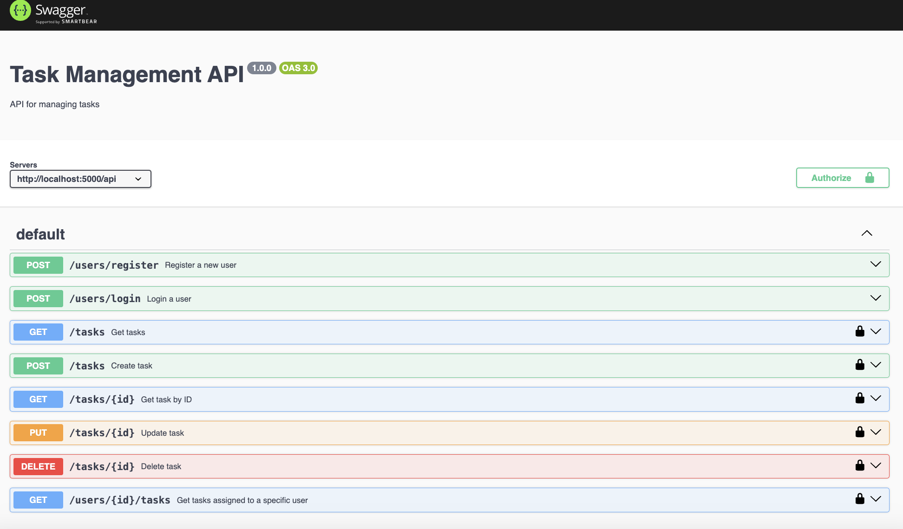

# Advanced Task Management API

The main idea to create a robust RESTful API for managing tasks using Node.js and Express.

Installation
-----------------

To install from GitHub, clone the repository and install dependencies using `npm`:

```sh
$ git clone https://github.com/Kirolloshenry196/Advance-Task-Manager
$ cd Advance-Task-Manager
$ npm install
```
add .env file
```sh
$ PORT = 5000
$ JWT_Key =  "secret"
```
Lastly, start the application with:

```sh
$ npm start
```

# API Endpoints

## Tasks
- **GET /tasks**: Retrieve a list of all tasks.
- **GET /tasks/:id**: Retrieve details of a specific task by ID.
- **POST /tasks**: Create a new task.
- **PUT /tasks/:id**: Update an existing task by ID.
- **DELETE /tasks/:id**: Delete a task by ID.

## User Management
- **POST /register**: Register a new user.
- **POST /login**: Authenticate a user and return a JWT.
- **GET /users/:id/tasks**: Retrieve tasks assigned to a specific user.


Swagger API documentation
-----------------


to open Swagger API documentation just browse to 

    http://localhost:3000/api-docs
